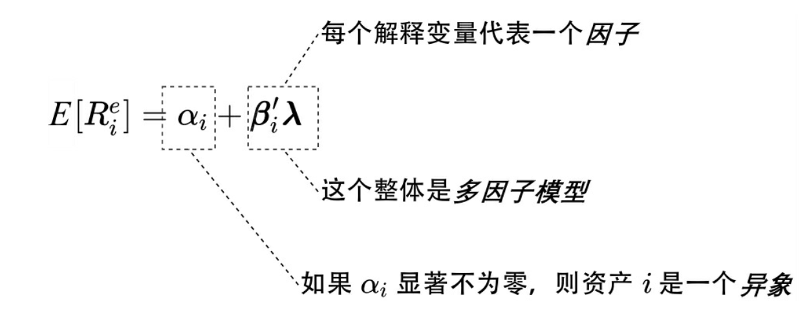
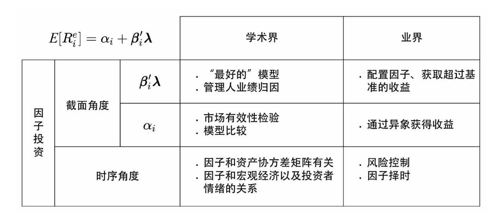

# 因子投资基础

# 1.因子投资基础
因子投资起始于一个最重要的资本定价模型-CAPM，该模型清晰的描绘出了理想状态下风险与收益率的关系。

$E[R_i]–R_f–\beta_i(E[R_M]–R_f)$

该公式里：$E[.]$是期望符号，$R_{i}$为某资产$i$的收益率，$R_{f}$为无风险收益率，$R_{M}$为市场组合的预期收益率。

$\beta_i\text{=cov(}R_i,\text{RM)}/\text{var(}R_M)$

在这个公式里，$\beta$用来描述了资产收益对市场收益的敏感程度（也就是当市场中其它资产的组合收益发生变化时，该资产收益应该如何变化）

值得一提的是，$\beta$也被称为资产$i$对市场风险的暴露程度。

CAPM是最简单的线性因子模型，它指出资产的预期超额收益率由市场组合的预期超额收益率和资产对市场风险的暴露大小决定，而市场组合也被称为市场因子。

在code/[1]CAPM.ipynb中，我展示了一个简单的例子使用来简单论证CAPM模型。

这个简单的关系为后续大量线性多因子定价模型的研究拉开了序幕。人们发现不同资产的收益率并非由单一的市场因子决定，而是同时受到其他因子的影响。在此基础上研究者提出了著名的APT模型（简称多因子模型），多因子模型假设资产$i$的预期超额收益由以下多元线性模型决定：

$E[R_i^e]=\boldsymbol{\beta}_i^{\prime}\boldsymbol{\lambda}$

其中$E[R_i^e]$表示资产$i$的预期超额收益，$\beta_i$是资产$i$的因子暴露（factor exposure）或称因子载荷（factor loading），$\lambda$是因子预期收益（factor expected return），也常被称为因子溢价（factor risk premium）

这个公式表明多因子模型研究的是不同资产预期收益率之间的差异，而非单一资产收益率在时间序列上的变化。

在多因子模型研究的术语中，不同资产预期收益率的差异通常被称为（横）截面（cross-sectional）差异，给定因子的预期收益率，资产预期收益率的高低由它在这些因子上的暴露$\beta$大小决定。

当考虑误差时，APT模型可以扩展为：

$E[R_i^e]=\alpha_i+\beta_i^{\prime}\lambda $

•如果$\alpha_i$并非显著的偏离零，那么可以认为它的出现仅仅是因为运气的原因；

•如果$\alpha_i$显著偏离零，它则代表了某个可以通过套利而获得超额收益的机会；它也同时说明由于某些原因，市场对该资产出现错误定价，从而导致其实际预期收益率和多因子模型下的预期收益率出现了偏离。

该如何理解这个alpha呢？

在资产定价模型中，$\alpha$ 通常被视为资产的超额回报，即在剔除了所有已知风险因素后（多变量），资产带来的额外回报。这种额外回报的原因可能是多样的，包括但不限于：
 
- 市场无效：如果市场未能正确定价该资产，会出现这种超额回报。按照有效市场假说，所有信息都应当反映在资产价格中，因此理论上不应存在长期的$\alpha$。
 
- 未模拟因素：可能存在模型未考虑到的影响因素，这些因素可能是市场心理、政治变动、宏观经济因素变化等。

理论上，如果一个资产或投资策略的$\alpha$显著大于零，投资者可以通过构建一个零成本的套利策略来实现无风险利润。在此策略中，投资者可能会做多这个资产，并做空其它相同风险的资产，以期获得这部分超额回报。

code/[3]alpha.ipynb中，我展示了一个简单的例子来展示如何利用alpha来进行无风险套利。

那么出现了一个很有意思的问题：如果说用1个因子能找到alpha的概率比用3个因子找到alpha概率更高（因为3个因子alpha更多），那么是不是说明单因子策略一定比多因子策略好？

事实上并不是，当用更多因子去构建模型时，理论上是试图解释更多的价格波动源头，从而将alpha（模型不能解释的部分）最小化。这样会减少找到显著alpha的概率，因为大部分收益变化已被模型解释。
 
但是，这并不意味着单因子策略"更好"。如果找到的alpha是由于模型遗漏了其他重要因素，那么这个alpha可能并不稳定，容易随外部影响变动或消失。

# 2. 因子、多因子模型与异象

可以这样简单了理解，beta衡量的是因子暴露出的一种普遍系统性风险（市场组合变动对投资组合的影响），lambda衡量的是在这种风险下我要求的资产超额回报，lambda可以看作是对beta的一种补偿。完美的因子是既要暴露出很高的beta，又要有足够的lambda来补偿beta。

由图可知，左侧不同资产的收益率均可以归结到有限个因子的收益率上，而不同资产预期收益率的高低由它们对因子的暴露大小决定。由此可以得出因子的定义：

一个因子描述了众多资产共同暴露的某种系统性风险，该风险是资产收益
率背后的驱动力；因子收益率正是这种系统性风险的风险溢价或风险补偿，它是这些资产的共性收益。
（简单来说，一个因子就是一个系统性风险，根据risk-return trade off原则，超额回报是对风险的补偿）

可以用食物作为一个例子，每种食物对人体的价值体现在两方面：（1）它包含哪些营养成分以及包含了多少（类比多因子模型中的$\beta$）；（2）该食品包含的每种营养成分对人体健康的重要性（类比多因子模型中的$\lambda$）。

把若干个因子放在一起使用就构成了一个多因子模型，如何确定一个多因子模型中到底有几个以及哪些因子，可以从以下两点考虑:

- 首先，很多因子之间都存在一定的相关性，高度相关的因子代表的是资产收益率所暴露的同一类系统性风险。在选择模型包括的因子时，必须要考虑相关性的影响，人们希望加入模型的因子是相互独立的、每个因子都能对解释资产预期收益率截面差异有显著的增量贡献。

- 其次要考虑简约法则。从定义出发，每个因子代表的是资产暴露的某种共性风险。因此从常识来说，多因子模型中因子的个数一定是有限的。学术界的主流多因子模型通常包括3～5个因子。

在选定了多因子模型后，如果资产的预期收益率中存在一部分无法被多因子模型解释，且这部分(alpha)显著大于零，那么该资产就是一个异象。

举个例子，在股票市场中，人们经常根据某个公司财务指标或者量价指标来把股票排序，并按照排序高低构建一个多、空对冲投资组合。将该投资组合作为一个资产放在多因子模型中，如果其$\alpha$显著大于零，那么就称该投资组合为一个异象，而构建该组合的指标就被称为异象变量（anomaly variable）。

在因子投资的术语中，无论是$\alpha$代表的异象还是$\beta\lambda$代表的因子往往都被称为因子。为了区分它们，只需要记住$\beta\lambda$是一个定价模型，因此它包含的因子又被称为定价因子（pricing factors）；而$\alpha$代表的是按某种方法构建出的能够获得多因子模型无法解释的超额收益的资产，因此它又被称为异象因子（anomaly factors）。

# 3. 策略与因子的关系

这里面有一点很容易搞混乱，那就是策略与因子的关系。
 
当开发一个投资策略时，通常是在选股、定位或决定进出时机。这个过程可能基于对市场的洞察、算法或特定事件的反应。而多因子模型的运用主要是为了分析这个策略的表现：检查策略是否有效地对抗市场波动、是否能在控制风险的情况下提供额外的收益alpha，以及策略的表现是否可以通过市场已知的风险因子来解释。 
 
在实际应用中，这种区分意味着：你首先设计并实施一种策略来操作市场。然后，使用因子模型来检验策略的表现。如果你的策略收益在考虑了各种市场风险因子后还有显著的alpha，那么这表明策略有成功的潜力，并且能带来额外的价值（超越普通市场因子的表现）。

当然，“因子”既是解释资产收益的工具，也可以作为构建策略的基础。这个过程涉及到从大量数据中挖掘能够带来超额收益的投资信号或特征（即因子），然后基于这些因子来设计投资策略。解释和策略构建这两种用途在实践中是相辅相成的。

一个策略是否是好策略，并不只取决于在单一的因子模型中的 (alpha) 表现，而是其在多种模型下的一致性、经济逻辑的支持、以及对各种风险的综合考虑。试想这样一个情况：我根据一个因子构建了一个策略，我用3个因子去解释它发现有显著的alpha，但我换成另外三个因子去解释它，alpha就消失了。那么这个策略是好策略还是坏策略呢？

这个问题意味着策略的评估结果可能极大地依赖于所选择用来解释收益的因子。不同的因子集可能捕捉到不同的市场风险暴露，如果选用的因子能够完全解释策略收益的变动，那么计算出的alpha可能非常接近零。反之，如果所选因子无法充分解释收益变动，alpha可能会显著不为零。 
 
如果替换的因子集包含了更多与策略收益直接相关的风险溢价因素，或者能更全面地覆盖市场风险，那么可能会导致alpha显著减少或消失。这表明策略收益可能主要由这些新因子中的市场风险成分驱动。 

在此基础上，我觉得需要认识到的很重要的一点就是：alpha更多的是对某些系统性风险暴露下超额回报的度量，如果不固定系统性风险的集合，alpha之间本身就没有可比较性。

# 4. 因子投资的研究区别
对于$\beta\lambda$:
学术界关注的是找到“最好”的多因子模型“最好”通常意味着在该模
型下资产的$\alpha$尽可能接近零，即该模型无法解释的异象越少越好。事实上，大量的实证数据研究表明，在选择了适当的多因子模型后，绝大多数主动基金管理人并不能获得超额收益,原因在前文也解释过。

(学术界的逻辑在于，我找一大堆已知收益结果的策略，然后想办法找到最合适的普适因子来解释这些收益，并且使得alpha尽可能不存在)

与学术界不同，业界进行因子投资最重要的目标是使用因子来获取超过基准的收益。因此业界从资产配置的角度聚焦于找到从长期来看有风险溢价的因子（即$\lambda$大），并以尽可能高的暴露（即$\beta$高）配置在这些因子上。

（业界的逻辑在于，我先研究因子，找出那些对系统性风险暴露高的，同时又有很高的超额回报补偿的因子来组建投资策略，然后再去验证这个策略的有效性。）

对于$\alpha$:

学术界研究alpha的目的在于解释异象并且评价多因子模型的优劣。比如两个多因子模型A和B，如果使用模型A时异象的个数少于使用模型B时
异象的个数，就会认为模型A比模型B更好。

而业界将定价因子与异象因子都视为因子，关注的是这个因子的风险暴露以及是否有足够的超额回报。

# 5. 截面与时序背景下的因子研究

在现代投资组合理论里，协方差矩阵通常被用来衡量投资组合的波动率/风险情况。

投资组合方差为：

$\sigma_p^2=\sum_{i=1}^n\sum_{j=1}^nw_iw_j\sigma_{ij}=\sum_{i=1}^n\sum_{j=1}^nw_iw_j\sigma_i\sigma_j\rho_{ij}$

其中$w$代表该资产在投资组合里的权重

投资组合的波动表示为：

$\sigma_p=\sqrt{\sigma_p^2}$

如果我们需要考虑的是如何去计算n个股票在m天里这个投资组合的波动率情况：

预期投资组合方差= SQRT (W T * (协方差矩阵) * W)

引入时序的视角，对于多因子模型来说：

$\boldsymbol{R}_t^e=\boldsymbol{\alpha}+\boldsymbol{\beta}\boldsymbol{\lambda}_t+\boldsymbol{\varepsilon}_t$

其中$R$为N维超额收益向量，$\alpha$为N维定价误差向量，$\beta$为N*K维的因子暴露矩阵，$\varepsilon$为N维的扰动项。

将预期收益向量转化为协方差矩阵的形式：
$\Sigma{=}\beta\Sigma_\lambda\beta^{\prime}{+}\Sigma_\varepsilon $

由于计算投资组合的波动率就必须知道资产之间的协方差矩阵。从数学上说，如果使用历史收益率序列计算样本协方差矩阵，那么历史数据的期数T需满足T≥N，否则用历史数据估算出的样本协方差矩阵就是不可逆的。当资产个数N很大时，要求T≥N是不切实际的。然而，如果把资产的收益率通过多因子模型转化为因子的收益率，则可以大大简化上述问题。

这部分可以通过 code/[4]投资组合波动率.ipynb 来理解。

# 6. 统一视角下的因子投资

那么在统一视角下，因子投资就可以理解为以下这样：

从截面来看，从预期超额收益出发，定价因子被用来解释这部分回报与市场的关系，而显著的alpha则是违背市场有效性的无法被衡量的部分。对于基金经理来说，他建立的策略可以来源于这些定价因子，帮助他获得超过市场基准的回报，也可以来源于脱离定价因子的异象部分。有趣的是现在并没有一个完美的模型，能够涵盖足够全面的定价因子使得市场组合的alpha为零，这也意味着一个基金经理是否找到了严格意义上的alpha而非定价因子是难说的，alpha可能只是尚未被发现或者普遍认可的定价因子。这也是为什么业界并不严格区分alpha和定价因子的原因。

对于学术界来说，要想检验市场的有效性就必须先有一个合理的资产定
价模型。只有知道了定价模型给出的均衡状态下股票的预期收益率，才有可能正确地检验市场是否有效，最核心的问题可以划分为三类：
- 哪些因子是独立的？
- 哪些因子是重要的？
- 因子驱动资产价格的原因是什么？

而对于业界来说，不同的管理人使用多因子模型的角度可能截然不同；有的管理人从截面的角度使用因子获取超额收益；而有的管理人从时序的角度使用多因子模型计算投资组合中股票之间的协方差矩阵，即风险管理；还有管理人使用多因子模型来同时进行收益预测和风险管理，并在这个基础上进行投资组合的优化。

1987年罗素推出了最早的两个风格指数，分别对标价值和成长因子。最初，推出这些指数的目的是评估主动基金经理人的业绩。然而不久之后，复制这些指数的基金便应运而生。这些指数基金一经推出便受到了追捧。人们把它们视作主动型价值投资的低成本替代品（毕竟谁也难说主动型基金经理找的是alpha还是beta）。鉴于价值因子取得的巨大成功，业界也开始把关注的重点转移到构造出了一系列Smart Beta ETF产品。