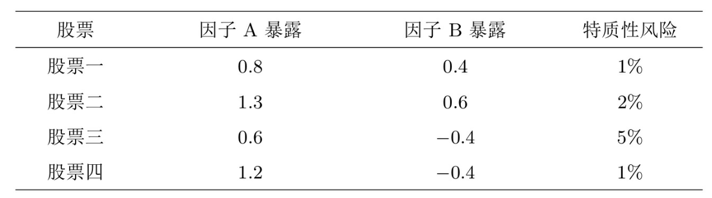

# 因子投资方法论

# 1. 投资组合排序法
根据前文已知一个因子代表了不同资产收益率的某种驱动力，而该因子的收益率就是这些资产的共性收益。$\beta\lambda$是一种衡量因子收益率与市场收益率之间的相关性的方程，其中$\beta$代表因子收益率与市场收益率的相关性，它是一个统计量，表明了投资组合的回报在多大程度上与市场回报同步变化。$\lambda$代表了因子的市场收益率。

如果说beta这种关系很容易量化，那么关注点就在于因子的收益率是如何计算出来的。举例来说，我们知道市场情绪和GDP都可以影响市场股票的收益，因此它们都可以作为因子来。解释股票的收益率，但是应该如何定量计算它们的收益率呢？这依靠的就是**因子模拟投资组合（factor mimicking portfolio）**。

因子模拟投资组合是模拟股票资产，围绕某目标因子构建的投资组合。该组合在理论上需要满足两个条件：

- 该投资组合仅在目标因子上有大于零的暴露、在其他因子上的暴露为零；(只能由这一个因子来进行归因)

- 在所有满足条件一的投资组合中，该投资组合的特质性风险
（idiosyncratic risk）最小

假设说我的因子和股票组合是这样的：

在这种情况下如果将股票一和股票二作为投资组合来检验因子A就会违反条件1，因为两者不仅在因子A上有暴露，在因子B上的因子暴露也非常高。因此，由它们二者构成的投资组合的收益率将受到因子A和B的共同影响。

在这个前提下最适用的是选取股票1和股票3作为投资组合，因为两者对我们的目标因子A都有正的暴露，但对因子B的暴露是相反的会被抵消掉。那么这样驱动投资组合收益的也就只剩下因子A了。

当然仅考虑条件1找出来符合条件的投资组合会很多，因此条件2还要求组合的特质性风险最小。对于多因子模型来说，个股的特质性风险源自个股收益率在时序上的随机扰动，即$\varepsilon$

如果说随机扰动非常显著，那么它对期望收益的影响就有可能压过因子对组合的影响。这也符合我们提出的“投资组合的收益中的绝大部分都由目标因子驱动”的原则。

简而言之，在因子暴露已知的前提下，人们可以通过不同的方法来构建因子模拟投资组合，来计算不同因子的收益，在众多方法里最常用的是**投资组合排序法（portfolio sort），简称排序法**。

（很明显这里有一个明显的漏洞，我的$\beta$指的是我的因子收益与组合期望收益之间的关系，这是在我已知因子收益的前提下才能计算出来的，但我的因子收益又需要在已知因子暴露值的前提下得出）

# 2. 排序法与检验

不难理解，一个股票的收益可能受到很多因子的影响，例如风格因子和宏观因子这两类。

风格因子包括市值、盈利、低波动等，
宏观经济因子包括GDP这一类经济数据。

排序法聚焦于风格因子而不适用于宏观经济因子，它优势在于舍弃了“因子暴露已知”这个条件，从而快速计算出因子收益。

具体的做法其实很好理解：我假设利用账面市值比作为一个价值因子，我将个股在该变量上取值的大小来代替个股在该因子上暴露的高低（假设在某只股票上，这个价值因子的值与它的暴露值是相关联的）。

该方法认为高因子值的股票在围绕这个因子构建的价值因子上的暴露更高，低因子值的股票在围绕该因子构建的价值因子上的暴露更低。

换个更简单的方式来理解，对于单因子模型：$E[R_i^e]=\boldsymbol{\beta}_i^{\prime}\boldsymbol{\lambda}$

如果我们的因子是围绕账面市值比这个财务指标来构建的，我们可以有这样的假设：

- 账面市值越高，公司价值就会越高，因而投资它的收益也就越高。
- 我的投资组合利用账面市值因子来赚钱
- 账面市值越高的股票，对我的投资组合的收益暴露就越高（这些股票的收益与我投资组合收益的联动性更强）

这也解释了为什么这一方法只对风格因子有用，而对宏观经济因子没有用。因为宏观经济因子无法抽象出与因子暴露值有关的变量。

(通过将因子值与因子暴露beta进行绑定，我们就可以用因子值来替代传统方法计算出的beta)

但是同时这也暴露出了排序法一个最大的问题：我们在组建因子模拟投资组合的时候是要求我们选取的投资组合在其他因子上的暴露为零，而排序法这种简单粗暴的选择方法明显忽视了这个问题。

## 2.1 单重排序法

应该如何使用排序法？

1. 按变量将股票排序
2. 把股票依排序分组构建投资组合
3. 定期更新投资组合

第一步很好理解，根据风格因子的值把股票按从高到低的方法进行排序就行。

第二步则是根据值的分布（不一定每组的股票数量一样），把股票分成10组。做多排名最高的第一组内的股票，并同时做空排名最低的最后一组内的股票而构建一个多、空对冲的投资组合，该投资组合又被称为价差组合（spread portfolio）。

由构建方式可知，价差组合中多、空两头的收益率分别为变量取值最高的那组股票的收益和变量取值最低的那组股票的收益，它们的差异（收益和）就反映了围绕该变量构建的因子的收益率。

通常要求多、空两个组合的金额相同，即整个因子模拟投资组合是资金中性的。此外，由于多、空两个投资组合都包含多支股票，因此需要为它们选择个股加权方式，其中最常见的是市值加权和等权重。

第三步也很好理解，由于这个因子值不断在变化，这会导致股票的排序也在进行变化，所以我们需要每隔一段时间进行换仓，也叫做再平衡rebalance。在时序上如此往复，就得到因子收益率的时间序列。

通过这个方法我们可以得到因子的收益率与投资组合的收益率，因此便可以检验因子预期收益率，以及投资组合收益率的单调性以考察这个因子的稳健性（portfolio sort test）。

我们关注的点在于依据样本数据计算出的因子收益率，能否在给定的显著性水平下拒绝原假设（即收益率为0这个假设）

$\hat{\lambda}=\frac{1}{T}\sum_{t=1}^T\lambda_t$

$\mathrm{s.e.}(\hat\lambda)=\frac{\mathrm{std}(\lambda_t)}{\sqrt T}$

因此我们可以进行t检验(t-statistic)，在这里t检验的目的是要检验这个因子收益率的均值是否显著不为零：

$t\text{-值}=\frac{\hat{\lambda}}{\text{s.e.}(\hat{\lambda})}$

因此，一旦样本数据计算出的收益率的t值高于2.0，就认为该结果在原假设下是显著的。如果原假设（因子预期收益率为零）无法被拒绝，那么被研究的因子就不满足预期收益率大于零的要求，

除此之外，由于一个好的因子应能够解释个股超额收益的截面差异，因此排序法关注的第二个问题就是依照排序变量高低得到的L个投资组合的收益率是否有很好的单调性，这可以通过计算收益率和排序变量分组的秩相关系数（rank correlation coefficient）来检验。秩相关系数和相关系数其实是类似的，区别在于它观测的是观测值排位上的相关性。

以Spearman秩相关系数为例，将L个投资组合的收益率的高低排位记为$X_r$、将它们依排序变量的分组的高低排位记为$X_g$，这二者的相关系数即为收益率和排序变量分组的秩相关系数$\rho_s$：

$\rho_s=\frac{\operatorname{cov}(X_r,X_g)}{\sigma_{X_r}\sigma_{X_g}}$

因此当L个投资组合的收益率随变量分组完美单调递增时，二者的秩相关系数为1；而当这些收益率随变量分组完美递减时，这二者的秩相关系数为-1。

我写了一个完整的方法来展示这一基本排序法的整个构建以及检验流程，代码在 code/[1]基本排序法.ipynb

## 2.2 多重排序法

多重排序法里最常见的就是双重排序法，即按照两个变量排序并构建因子模拟投资组合。考虑两个排序变量X1和X2，将股票按照这两个变量分别划分为L1和L2组，
一共得到L1×L2个组合。

需要考虑的是，对于这两个变量：
- 分别独立的进行排序 independent double sorting
- 排序存在依存关系 dependent/conditional double sorting